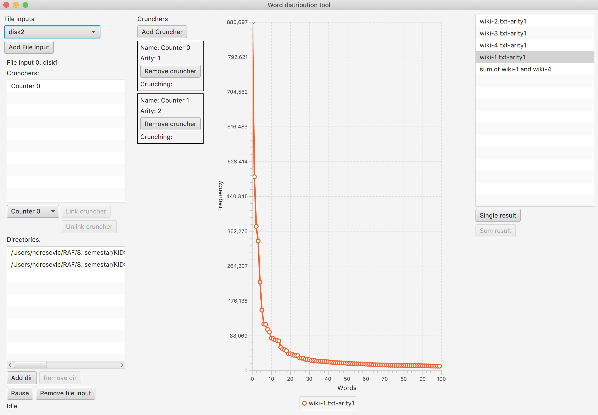

# Word Distribution Tool

WDT which enables calculating the distribution of occurrences of bags of words in a text. 
The calculation is concurrent, with the ability to add new sources of text to analyze in real-time. 
The system makes it possible to calculate the distribution of the number of occurrences of bags of words for individual 
documents, as well as aggregation of the results of several previous calculations.

